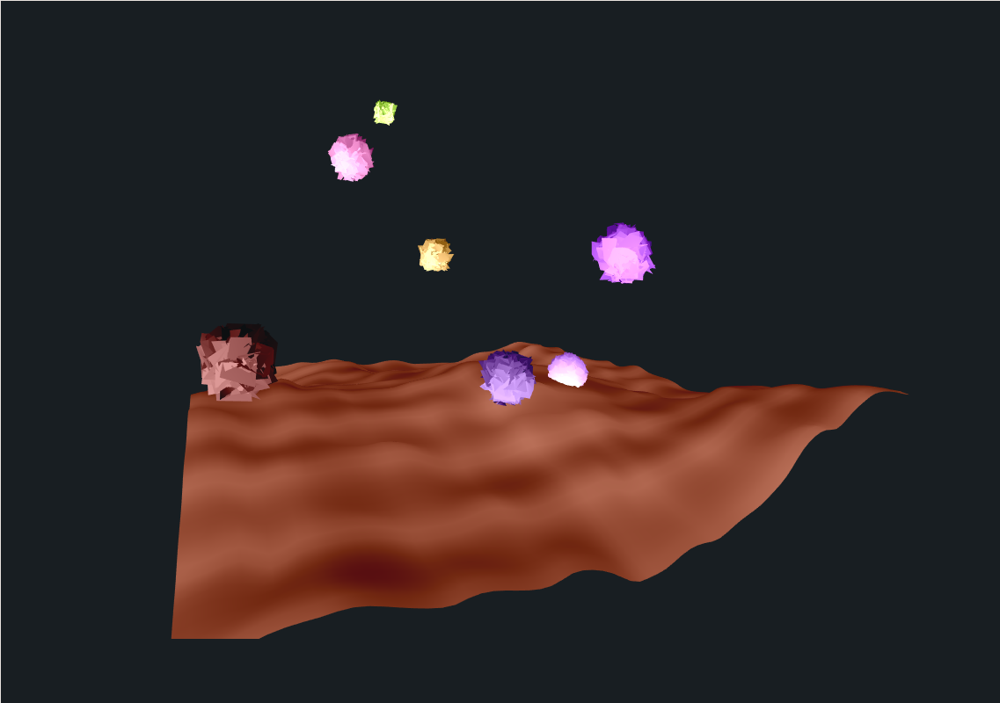

3d Art in your browser !
========================



# Description
This repository is an experiment showing what you can do with wasm, rust and webgl, a powerfull 3d rasterization engine.
It's gpu accelerated !

# Running the project

## Prerequisites:
You first need the rust language tooling installed on your system (look for `rustup` or `rust` in your repos). There is also the [official page](https://www.rust-lang.org/tools/install)

After you've done that, run:
```bash
cargo install cargo-watch
```
And on linux, make sure the folder `~/.cargo/bin` is in your PATH variable (echo `export PATH=$PATH:~/.cargo/bin > ~/.profile` and reboot)

Then, if you use yarn (:+1:)

```
git clone https://github.com/rambip/web-3d 
yarn install
yarn start
```

If you use npm (:-1:)
```
git clone https://github.com/rambip/web-3d
npm install
npm start
```
