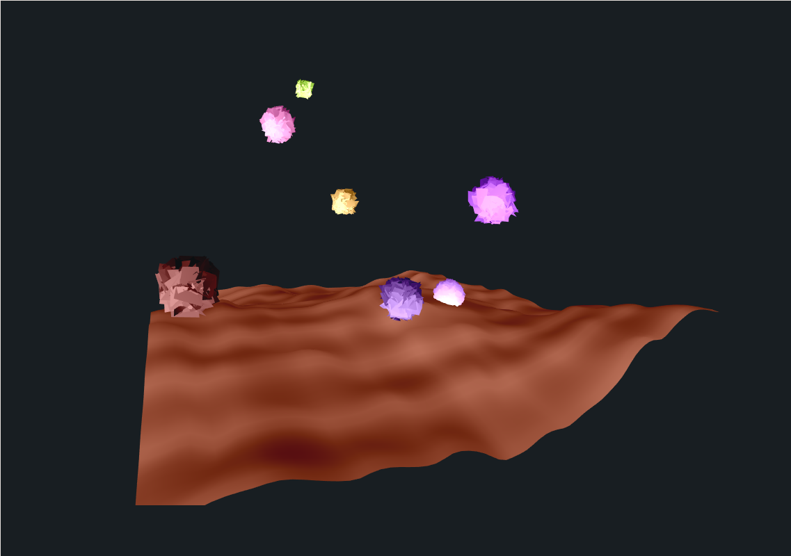

# 3d Art in your browser !

This repository is an experiment showing what you can do with wasm, rust and webgl, a powerfull 3d rasterization engine.
It's gpu accelerated !

You can build it with **build.sh**. The site will run locally, just type 'http://localhost:8000/' in your browser to test it.

- Prerequisites:
- - [rustup](https://www.rust-lang.org/tools/install) with cargo, the rust compiler and package manager

- - Python 3 with the `http.server` module. Try `pip install http.server` if you don't have it.

